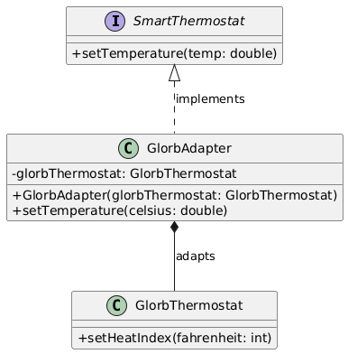

# OmniHome Smart Hub - Lab 2

This is a simple Java lab project.
The goal is to show design patterns using a smart home example.

## What this project does

`src/Main.java` runs a demo where:

1. The app starts and gets cloud connection object two times.
2. It shows both are the same object.
3. It creates smart devices using a factory.
4. It connects a legacy thermostat using an adapter.
5. It builds an automation routine.
6. It clones a configuration object and checks original is not changed.

## Design patterns used

- **Singleton** - `CloudConnection`
- **Abstract Factory** - `DeviceFactory`, `LuxuryFactory`, `BudgetFactory`
- **Builder** - `RoutineBuilder` for `AutomationRoutine`
- **Adapter** - `GlorbAdapter` for `GlorbThermostat`
- **Prototype** - `Configuration.clone()`

## UML diagram

Adapter pattern diagram:



## Folder structure (main parts)

```text
lab2-assignment/
  src/
    Main.java
    main/omnihome/
      automation/   -> routine classes
      config/       -> configuration class
      connection/   -> cloud connection singleton
      devices/      -> smart device interfaces and implementations
      legacy/       -> old thermostat and adapter
```

## How to run

Run these commands from `lab2-assignment` folder:

```bash
mkdir -p out
javac -d out $(find src -name "*.java")
java -cp out Main
```

## Expected output (simple)

You should see messages about:

- smart hub start
- same singleton object check
- cloud connection
- luxury device actions
- adapter converting C to F
- created routine details
- clone test success (original config stays safe)

DEMO OUTPUT:
```
------- Smart Hub OmniHome initialization starts ------
CloudConnection initialized.
First CloudConnection instance memory address at: main.omnihome.connection.CloudConnection@6b95977
Second CloudConnection instance memory address at: main.omnihome.connection.CloudConnection@6b95977
Both instances are the same object.
CloudConnection connected.
Connected to https://omnihome.codeany.orgby using key: SUPERSUPERSECRETKEY
Initializing Luxury Home...
At the moment LuxuryLight (Glass) is ON.
Face Scanning process happens by LuxuryLock (Face ID)...... Access Granted. At the moment is LOCKED.
Predicting comfort tool is activate by LuxuryThermostat (AI-powered)... At the moment setting temperature to 24.0°C instantly.
After analyze Glorb Legacy Thermostat was found
Plugging it into the Smart Hub by using GlorbAdapter...
Command setTemperature(25.0°C) is activating
At the moment, GlorbAdapter is converting 25.0°C to 77°F...
At the moment, Glorb Legacy Thermostat setting heat index to 77°F.
Successfully built routine:
AutomationRoutine{name='Vacation Mode', devicesCount=4, triggerTime='08:30 AM', sendNotification=true}
Living room's original config is: Configuration{ipAddress='172.30.20.250', port=8000, firmwareVersion='v0.0.1'}
Guest room's original config is: Configuration{ipAddress='172.30.20.250', port=8000, firmwareVersion='v0.0.1'}
Changing Guest Room IP to 172.30.20.249...
After Change - Original Config: 172.30.20.250
After Change - Cloned Config:   172.30.20.249
Changing duplicate did NOT affect the original! - SUCCESS!!!!
```